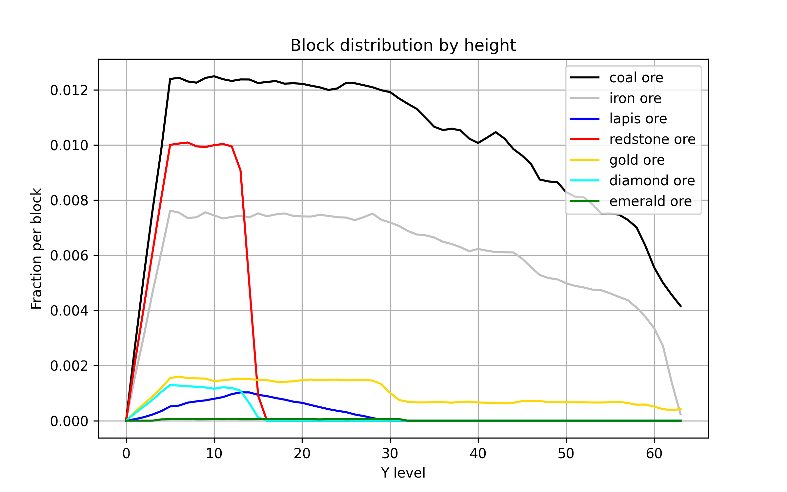

# WorldLayers

Command line program to scan your Minecraft worlds and plot block distribution by height or print overall block statistics.

### Features:
- Plot distribution of any selection of blocks by Y layer.
- Print total statistics of the number of blocks.
- Supports scanning Anvil, Region and Alpha worlds (tested versions: a1.2.6 - 1.19).
- Save and load scan results from a file; no need to re-scan to visualize different set of blocks.

### Example output

- Ore distribution (version 1.12.2)



- Overall block counts (version 1.19)

```
Loaded data for 56413 chunks, Y levels -64 ~ 256
378 unique blocks
1917 block states
Nonair blocks = 1872173210	(40.511366%)	(33186.9110 b/ch)
minecraft:air = 2746607975	(59.432984%)	(48687.5007 b/ch)
minecraft:deepslate[axis=y] = 741053519	(16.035424%)	(13136.2189 b/ch)
minecraft:stone = 605523935	(13.102742%)	(10733.7659 b/ch)
minecraft:water[level=0] = 111475752	(2.412189%)	(1976.0649 b/ch)
minecraft:tuff = 61631469	(1.333624%)	(1092.5047 b/ch)
minecraft:andesite = 56471794	(1.221975%)	(1001.0422 b/ch)
minecraft:diorite = 53720626	(1.162444%)	(952.2739 b/ch)
minecraft:granite = 51893443	(1.122906%)	(919.8845 b/ch)
minecraft:bedrock = 43325320	(0.937503%)	(768.0024 b/ch)
minecraft:dirt = 38223181	(0.827099%)	(677.5598 b/ch)
minecraft:gravel = 29905801	(0.647122%)	(530.1225 b/ch)
minecraft:grass_block[snowy=false] = 6492168	(0.140482%)	(115.0828 b/ch)
minecraft:clay = 6305134	(0.136435%)	(111.7674 b/ch)
minecraft:coal_ore = 5743531	(0.124282%)	(101.8122 b/ch)
minecraft:copper_ore = 5722340	(0.123824%)	(101.4365 b/ch)
...
```


## Installation

### Requirements
- Python 3.9 or higher
- Libraries: [uNBT](https://github.com/Metaray/uNBT), numpy, matplotlib
- Some C compiler for building accelerators library

### Steps
1. Install Python dependencies
    
    `pip install -r requirements.txt`

2. Compile accelerators library

    Run `build_accelerators.py` if you have C compiler that is visible to Python's `distutils` library.
    
    Or manually compile `extract_helper.c` into shared library with the same name. For example on Windows with GCC:

    `gcc -Wall -Wextra -O3 -march=native -shared extract_helper.c -o extract_helper.dll`


## Command line syntax
`cli.py <data source command> [options...] <visualization command> [options...]`

To display help in terminal use `cli.py -h` or `--help`

### Data source commands
```
Load and display block histogram from file:
load <histfile>
    histfile                Path of histogram file to display

Calculate block histogram for chosen world:
extract [--dim DIM] [--limit LIMIT] [--layers LAYERS] <world>
    world                   Path to directory of a world to scan
    --dim DIM               Numerical ID of target dimension
                            (default is 0 - Overworld)
    --limit LIMIT           Number of chunks to scan (default is all)
    --layers LAYERS         Vertical scan limits (default is 0-128)
                            Format: Y_LOWER-Y_UPPER_NONINCLUSIVE
```

### Visualization commands
```
Save extracted block histogram:
save <output>
    output                  Name of the new histogram file

Plot histogram of block distribution:
plot [--norm TYPE] [--normbase NORMBASE] [--solids] [--cumulative]
     [--layers LAYERS] [--savefig SAVEFIG] <selectors...>
    selectors               Any number of selector arguments (see below)
    --norm TYPE             Histogram value normalization (default is total)
        none                Total counts per layer
        base                Fraction relative to some block per layer
                            (specified in --normbase)
        total               Fraction per block of a layer
        chunk               Mean count per layer of a chunk
    --normbase NORMBASE     Blockstate name (or names separated with "+") for
                            relative normalization (used with --norm base)
    --solids                Display graph for total non-air blocks
    --cumulative            Display as a cumulative graph
    --layers LAYERS         Vertical range to display (default is full range)
    --savefig SAVEFIG       Save plot to specified file instead of displaying
                            in a window

Print total block statistics:
print [--sort ORDER] [--sumstates]
    --sort ORDER            Display ordering
        id                  Sort by block ID (only for old version scans)
        count               Sort by block count descending
        name                Sort by blockstate name lexicographically
    --sumstates             Sum counts of different states of a single block
                            into one

Print selected block histograms as CSV:
csv [--layers LAYERS] [--bylayer] [--showy] <selectors...>
    selectors               Any number of selector arguments (see below)
                            or one argument "*" to output all blocks
    --layers LAYERS         Vertical range to use
    --bylayer               Print counts for each Y layer on a separate line
                            (default is line per selector)
    --showy                 Add Y level column to output
```

### Selector format
```
Selector is a comma separated list of:
    blockstate              Plus (+) separated names of blockstates (see below)
                            to visualize. All blockstates in one selector are
                            added together.
    color                   Color of the graph (any color acceptable by
                            matplotlib, i.e. "blue", "#aa5500")
    display name            Name of the graph

Color can be omitted. Some distinct color will be used automatically.
Display name can be omitted. Blockstate name will be used for display instead.

Examples:
stone
minecraft:chest,,Chest
minecraft:water,blue,water
minecraft:coal_ore+minecraft:deepslate_coal_ore,black,Coal ore

Alternatively, selector can name a file containing multiple selectors.
Name is prefixed with @ symbol.
File will be read as CSV described above: nonempty lines will be parsed and
added to selector list, empty lines and lines starting with # symbol will be
skipped.
```

### Blockstate format
```
Full form:
namespace:block_name[property1=value1,property2=value2]

If state dictionary is omitted (i.e. "minecraft:water") - visualizations sum
all different states together.

Namespace can be omitted (i.e. "redstone_ore[lit=true]") - assumes default
namespace of "minecraft:"
```


## Example usage
- Scan full height range of 1.19 Overworld and save results

    `cli.py extract "MC 1.19 World" --limit=-64-256 save my_1.19_scan.dat`

- Do a small scan (500 chunks) of Nether and display block counts

    `cli.py extract "MC 1.19 World" --dim=-1 --limit=500 print`

- Load scan and display block counts without separating states

    `cli.py load my_1.19_scan.dat print --sumstates`

- Load scan and plot ore distribution (selectors are inside a file "vanilla_ores")

    `cli.py load my_1.19_scan.dat plot @vanilla_ores`

Sample scan data and selector files are provided in `sample-data` directory.
